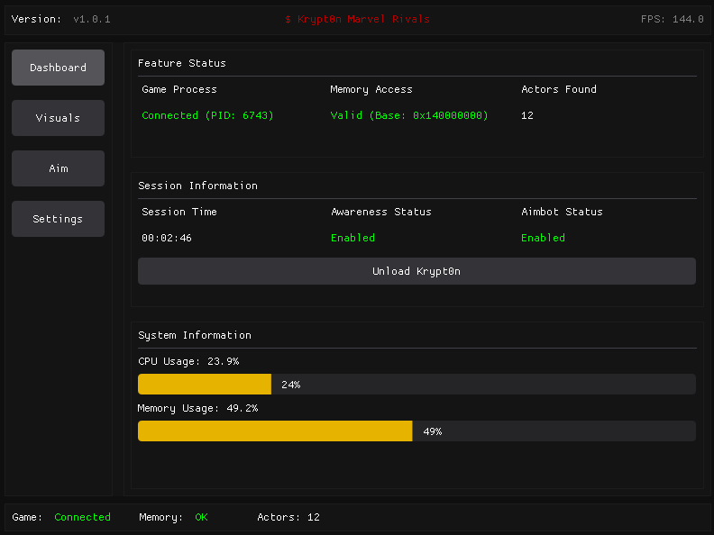
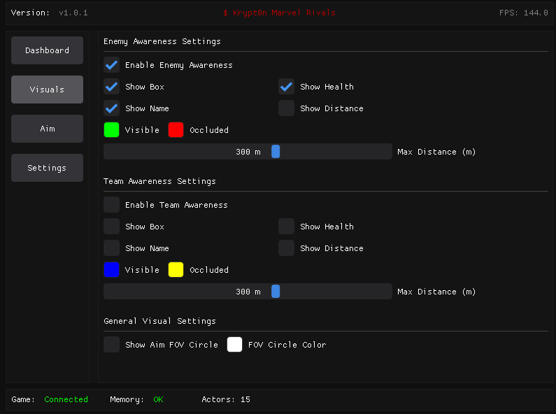
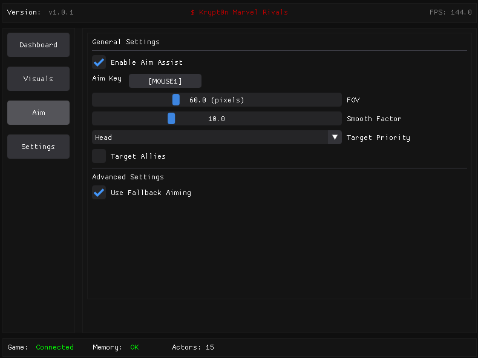
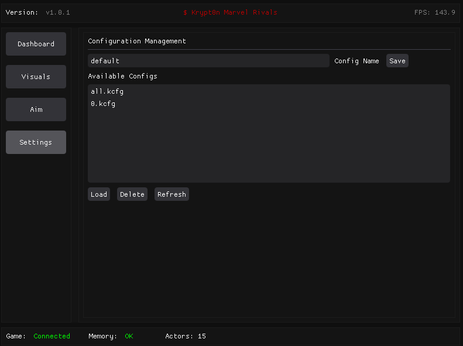

# Krypt0n - Marvel Rivals External (Linux)

Krypt0n is an external assistance tool for the game Marvel Rivals, designed for Linux systems. It provides features such as ESP (Visuals), Aimbot (Accuracy Assist), and a configurable ImGui menu.

**⚠️ WARNING: USE AT YOUR OWN RISK! ⚠️**

Using this software can lead to your game account being banned. Developer is not responsible for any consequences that may arise from its use. This tool requires **root (sudo) privileges** to run due to its need for memory access (`process_vm_readv`) and virtual mouse input (`/dev/uinput` via libevdev).

---

## Features

*   **Visuals (ESP):**
    *   Enemy & Team Awareness (separate toggles & settings)
    *   2D Boxes
    *   Health Bars
    *   Hero Names
    *   Distance Display
    *   Configurable Colors
    *   Configurable Max ESP Distance
*   **Accuracy Assist (Aimbot):**
    *   Enable/Disable Toggle
    *   Configurable Aim Key (Mouse 1-3, common keyboard keys)
    *   Adjustable FOV (Field of View for targeting)
    *   Smoothing Factor
    *   Target Bone Selection (Head/Body - **Currently relies heavily on Fallback Aiming**)
    *   Option to Target Allies
*   **GUI:**
    *   User-friendly ImGui based menu
    *   Dashboard displaying game status and session information
    *   Configuration System: Save and load your settings to `.kcfg` files

---

## Dependencies

To compile and run Krypt0n, you will need the following dependencies installed on your Linux system:

*   **CMake** (version 3.10 or higher)
*   **A C++17 compatible compiler** (e.g., GCC or Clang)
*   **`pkg-config`**
*   **OpenGL Development Libraries**
*   **GLFW3 Development Libraries**
*   **GLEW Development Libraries**
*   **X11 Development Libraries**
*   **libevdev Development Libraries**
*   **pthread**

You can install these using your distribution's package manager.

On Debian/Ubuntu-based systems:
```bash
sudo apt update
sudo apt install cmake build-essential pkg-config libglfw3-dev libglew-dev libx11-dev libxfixes-dev libevdev-dev
```
on Arch-based systems
```
sudo pacman -Syu --needed cmake base-devel pkgconf glfw-x11 glew libx11 libxfixes libevdev
```

## Run the Script

```sudo ./krypt0n.sh```





